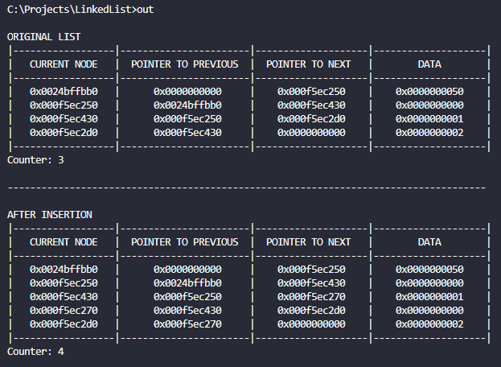

# Linked List

This Linked List library is created as an exercise to understand pointers, dynamically allocated memory, and other fundamental concepts. It's currently a work in progress, but don't worry; we're making progress (slow and steady).
<br><br>

The star of the show is the following struct that registers the pointers to next and previous node. More data parameters can be added:

```C
typedef struct NODE
{
    struct NODE *previous;
    struct NODE *next;
    uint32_t data;
} NODE;
```

### Example: Node insertion



# To compile it

I'm using [MinGW](https://www.mingw-w64.org/) in a windows machine. The file 'compile_and_run.bat' has a handful of instructions to compile and run the executable. Pretty simple.

# Features

- Print one node data;
- Print all nodes data;
- Find first or last node;
- Append node at the end of linked list;
- Insert on node after another;
- Get "nth" node from the start or from other arbitrary node;
- Exclude (free) node;

For (almost) each feature, there is a "TEST_" funcion that tests it in someway or another.

# To do
 
 - Develop a new way to print all nodes: Maybe a table written on console (DONE ✔️) or a .CSV file;
 - Sort list by data;
 - Insert node in its place (maintaining order);
 - Function to return the size of space used by linked list;